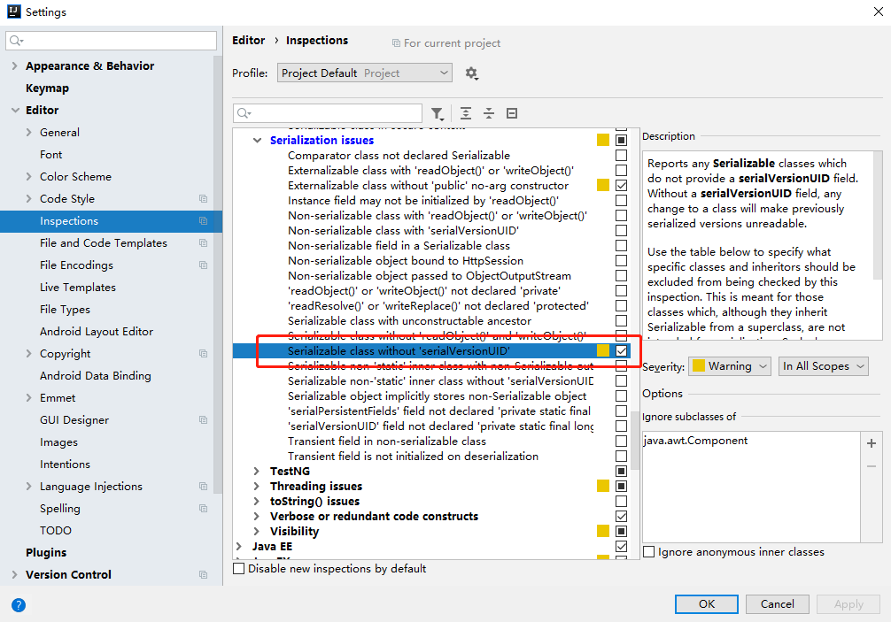
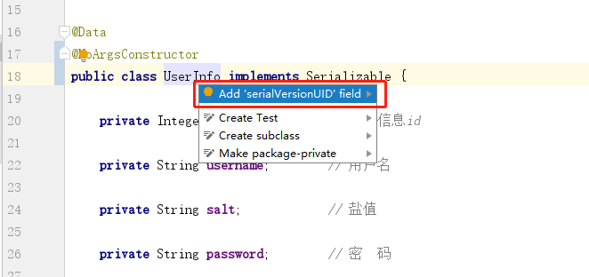

Redis
=====

在Spring中，RedisConnection接口通过驱动Jedis连接Redis，进而操作Redis。

**pom.xml**

```xml
<!-- https://mvnrepository.com/artifact/org.springframework.boot/spring-boot-starter-data-redis -->
<dependency>
    <groupId>org.springframework.boot</groupId>
    <artifactId>spring-boot-starter-data-redis</artifactId>
    <exclusions>
        <exclusion>
            <groupId>io.lettuce</groupId>
            <artifactId>lettuce-core</artifactId>
        </exclusion>
    </exclusions>
    <version>2.1.4.RELEASE</version>
</dependency>

<dependency>
    <groupId>redis.clients</groupId>
    <artifactId>jedis</artifactId>
    <version>2.9.0</version>
</dependency>
```

**application.properties**

```properties
# Redis
spring.redis.jedis.pool.min-idle=5
spring.redis.jedis.pool.max-idle=10
spring.redis.jedis.pool.max-active=10
spring.redis.jedis.pool.max-wait=2000
spring.redis.database=0
spring.redis.port=6379
spring.redis.host=127.0.0.1
spring.redis.password=123456
spring.redis.timeout=2000
```

想要将对象存入redis，需要通过序列化的方式将对象序列化，下面就是一个自定义RedisTemplate的配置，加入该配置后就可以直接使用RedisTemplate存储对象。

```java
import org.springframework.cache.annotation.EnableCaching;
import org.springframework.context.annotation.Bean;
import org.springframework.context.annotation.Configuration;
import org.springframework.data.redis.connection.RedisConnectionFactory;
import org.springframework.data.redis.core.RedisTemplate;
import org.springframework.data.redis.serializer.*;

/**
 * Redis configuration
 * @author noTalent
 * @version 1.0
 * 2019.05.14
 */
@Configuration
@EnableCaching
public class RedisConfig {

    @Bean("redisTemplate")
    public RedisTemplate<String, Object> redisTemplate(RedisConnectionFactory factory) {
        RedisTemplate<String, Object> redisTemplate = new RedisTemplate<>();
        redisTemplate.setConnectionFactory(factory);

        // 对象序列化
        JdkSerializationRedisSerializer redisSerializer = new JdkSerializationRedisSerializer();

        // String序列化
        StringRedisSerializer stringRedisSerializer = new StringRedisSerializer();

        redisTemplate.setKeySerializer(stringRedisSerializer);
        redisTemplate.setHashKeySerializer(stringRedisSerializer);
        redisTemplate.setValueSerializer(redisSerializer);
        redisTemplate.setHashValueSerializer(redisSerializer);

        redisTemplate.afterPropertiesSet();
        return redisTemplate;
    }

}
```

RedisTemplate的使用。

```java
public class RedisTemplateTest {

    @Resource
    private RedisTemplate redisTemplate;

    @Test
    public void test() {
        // redis存储
        redisTemplate.opsForValue().set("user", new User("username", "password"));
        // 获取user对应的value
        User user = (User)redisTemplate.opsForValue().get("user");
    }

}
```

**序列化与反序列化**

> 如果想要通过Redis存储java对象，实体类就得实现序列化接口Serializable，才能将对象以二进制序列的形式存储到磁盘里面。

* **序列化**：对象转换成字节序列的过程。
* **反序列化**：字节序列转换成对象的过程。

实现Serializable接口，最好的方式是自己生成一个serialVersionUID，而不是等待它自动生成，因为一个确定的serialVersionUID才能更好的让对象进行反序列化。

在IDEA中，可以自动生成serialVersionUID。



设置好之后对着想要序列化的类名`Alt + Enter`。



```java
import lombok.Data;
import lombok.NoArgsConstructor;

import java.io.Serializable;
import java.util.Date;

/**
 * 用户信息实体类
 * @author noTalent
 * @version 1.0
 * 2019.05.08
 */

@Data
@NoArgsConstructor
public class UserInfo implements Serializable {

    private static final long serialVersionUID = 3913083570663658513L;

    private Integer userInfoId;     // 用户信息id

    private String username;        // 用户名

    private String salt;            // 盐  值

    private String password;        // 密  码

}
```